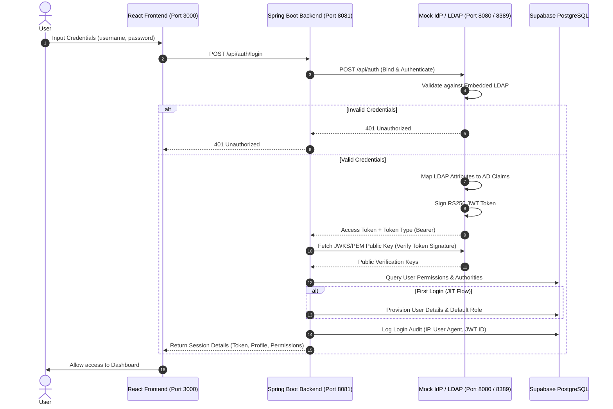

# ITEA Department Portal

The **ITEA Department Portal** is an enterprise-grade system designed for employee directory lookup, authentication auditing, and employee management. It consists of a React frontend client, a Java Spring Boot modular monolithic backend, and a custom Spring Boot Mock Identity Provider (IdP) mimicking active directory LDAP authentication.

---

## 🏗️ System Architecture

The following diagram illustrates the interaction between the frontend app, backend server, Mock IdP, and database:



---

## 📁 Repository Overview

The repository is structured as a multi-service setup managed by [docker-compose.yml](file:///c:/My%20Projects/ITEA_Dept-Portal/docker-compose.yml):

1. **[IDP_Service](file:///c:/My%20Projects/ITEA_Dept-Portal/IDP_Service)**: An embedded mock Active Directory/LDAP server running on port `8389` alongside a REST authorization API on port `8080` that issues RS256-signed JWT tokens, PEM public keys, and JSON Web Key Sets (JWKS).
2. **[ITEA_Dept_Portal_Backend](file:///c:/My%20Projects/ITEA_Dept-Portal/ITEA_Dept_Portal_Backend)**: A Modular Monolith Spring Boot application handling database operations, authorization filtering via [JwtAuthenticationFilter.java](file:///c:/My%20Projects/ITEA_Dept-Portal/ITEA_Dept_Portal_Backend/authentication/src/main/java/com/msil/iteadeptportal/auth/filter/JwtAuthenticationFilter.java), and user provisioning via [UserFacadeImpl.java](file:///c:/My%20Projects/ITEA_Dept-Portal/ITEA_Dept_Portal_Backend/employee-management/src/main/java/com/msil/iteadeptportal/employee/service/UserFacadeImpl.java).
3. **[frontend](file:///c:/My%20Projects/ITEA_Dept-Portal/frontend)**: A React client built with Vite, Tailwind CSS v4, and React Router v7. Includes interactive dashboards, user management interfaces (activate/deactivate), search/filter lists, and audit profile screens.

---

## 🔑 Mock LDAP Credentials

Test accounts are preloaded into the LDAP service via [setup.ldif](file:///c:/My%20Projects/ITEA_Dept-Portal/IDP_Service/setup.ldif). You can use these accounts to verify authorization, access controls, and JIT provisioning:

| Username | Password | LDAP Groups / MemberOf | Mapped Portal Role | Description / Status |
| :--- | :--- | :--- | :--- | :--- |
| `dev` | `password123` | `DE_CGV4`, `Employees` | `ROLE_USER` | Valid department developer. |
|

---

## ⚡ Quick Start

### Option A: Run via Docker Compose (Recommended)

Make sure you have Docker and Docker Compose installed.

1. Create a `setup.ldif` file inside `IDP_Service` folder by copying the example:
   ```bash
   cp IDP_Service/setup.ldif.example IDP_Service/setup.ldif
   ```
2. Run the services from the root folder:
   ```bash
   docker-compose up -d --build
   ```
3. The services will start on the following ports:
   - **Frontend App**: `http://localhost:3000`
   - **Backend API**: `http://localhost:8081`
   - **Mock IdP Service**: `http://localhost:8080` (LDAP on port `8389`)

---

### Option B: Run Locally

If you prefer to run services natively on your local machine:

#### 1. Start the IDP Service
1. Navigate to the IDP directory:
   ```bash
   cd IDP_Service
   ```
2. Copy the environment variables:
   ```bash
   cp .env.example .env
   ```
3. Run the Spring Boot application:
   ```bash
   ./mvnw spring-boot:run
   ```

#### 2. Start the Backend Monolith
1. Navigate to the Backend directory:
   ```bash
   cd ../ITEA_Dept_Portal_Backend
   ```
2. Copy the environment variables:
   ```bash
   cp .env.example .env
   ```
3. Fill in your PostgreSQL Database settings inside `.env` (it connects to Supabase database by default).
4. Run the modular monolith app:
   ```bash
   ./mvnw spring-boot:run
   ```

#### 3. Start the React Frontend
1. Navigate to the Frontend directory:
   ```bash
   cd ../frontend
   ```
2. Install dependencies:
   ```bash
   npm install
   ```
3. Copy environment settings:
   ```bash
   cp .env.example .env
   ```
4. Update `VITE_API_BASE_URL` inside `.env` to `http://localhost:8081`.
5. Launch the development server:
   ```bash
   npm run dev
   ```

---

## 🔒 Security Features

- **Dynamic JWKS & PEM Verification**: The backend dynamically retrieves verification keys from the IdP service using JWKS (`/.well-known/jwks.json`) to validate bearer tokens securely.
- **Login Auditing**: Every successful and failed authentication request logs metadata including JWT claims ID, client IP address, and User-Agent header inside the PostgreSQL audit table.
- **Hierarchical Access Levels**: Roles and permissions are initialized and maintained dynamically inside the database schema (automatically populated by [DatabaseSeeder.java](file:///c:/My%20Projects/ITEA_Dept-Portal/ITEA_Dept_Portal_Backend/employee-management/src/main/java/com/msil/iteadeptportal/employee/config/DatabaseSeeder.java) on startup) mapping privileges transitively from `ROLE_USER` to `ROLE_MANAGER` to `ROLE_ADMIN`.
- **IP & Rate-Limiting**: The Mock IdP enforces a configurable rate limit based on client IP addresses (configured inside `IDP_Service/.env`) to safeguard endpoints against brute-force attacks.
